<h1 align="center">
  Spring-boot React
  
 
  
  
  
  
  
  <br>
</h1>

<p align="center">
  <a href="#ℹ%EF%B8%8F-introduction">Introduction</a> •
  <a href="#installation-guide">Installation Guide</a> •
  <a href="#screenshots">Screenshots</a> •
  <a href="#license">License</a> •
  <a href="#contributors">Contributors</a> 
</p>

<div align="center">


</div>

## ℹ️ Introduction

- This is a simple application to demonstrate how to integrate Spring Boot and React. 
- The application is a simple tutorial application that allows users to register and login to the application. Once the user logs in, they can view a list of tutorials. The user can also create, edit and delete tutorials. 
- JWT is used for authentication and authorization. (Role based)

> [!TIP]    
> For more detail about the application, please refer to the following project: [Spring Boot](https://github.com/Ctere1/spring-boot) 

> [!NOTE]     
>Application creates (register) default user as "ROLE_USER". You can add more users with different roles via API or swagger. 

## 💾Installation Guide

- To clone and run this application, you'll need [Git](https://git-scm.com) and [Node.js](https://nodejs.org/en/download/) (which comes with [npm](http://npmjs.com)) installed on your computer. From your command line:

    ```bash
     # Clone this repository
    $ git clone https://github.com/Ctere1/spring-boot-react
    # Go into the repository
    $ cd spring-boot-react
    # Install dependencies
    $ npm install
    # Run the app
    $ npm start
    ```

## 📷Screenshots

### **Login - Signup Pages**
> * User can login on this page.
>
>   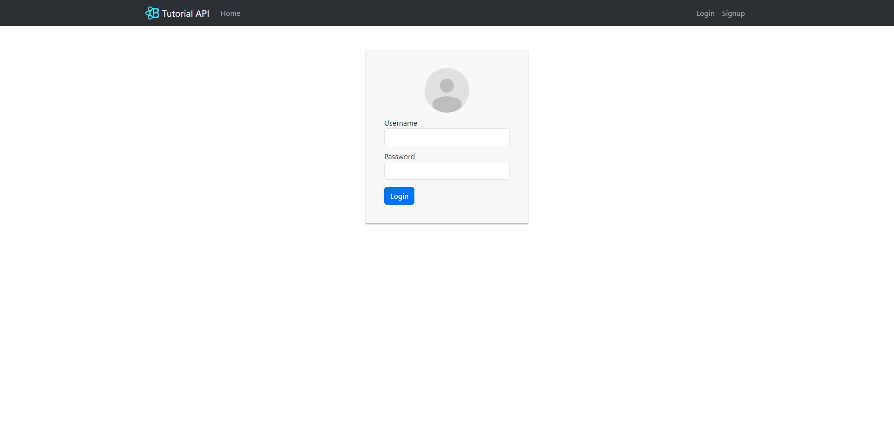
>
> * User can signup on this page.
>
>   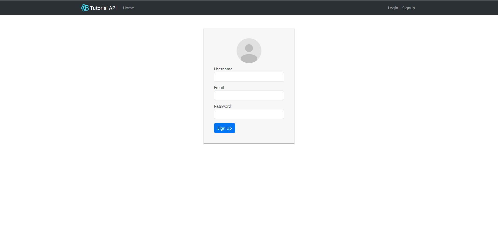


### **Home Page**
> * Home page.
> 
>   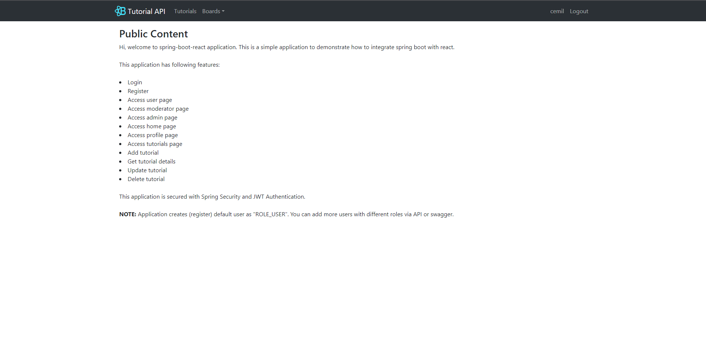


### **User Pages**
> * User can see own profile on this page.
>
>   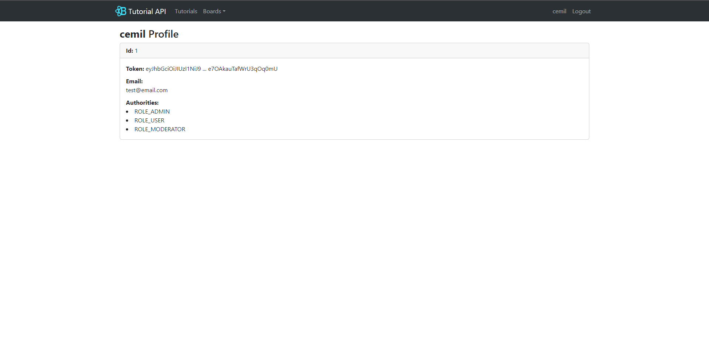
>
>
> * User can edit, list and delete tutorials on this page.
> 
>   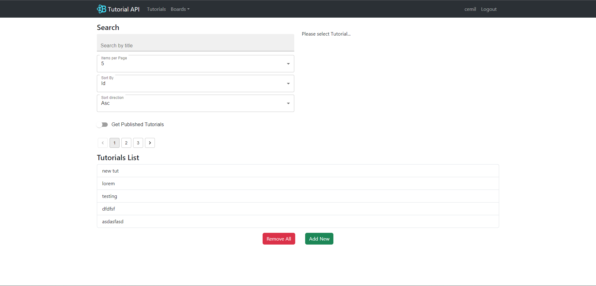
>   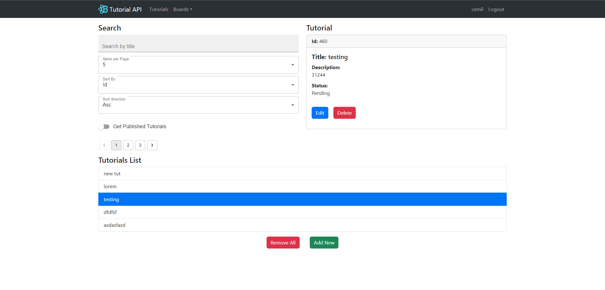
>   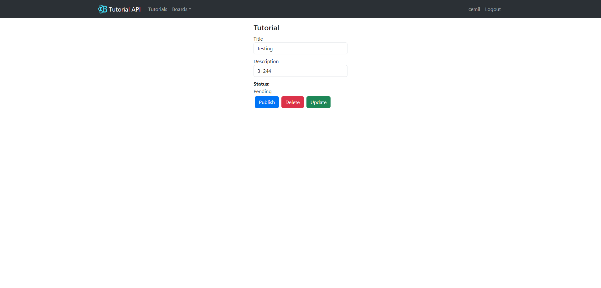

### **Boards Pages**
> * ROLE_USER can see the content on this page.
>
>   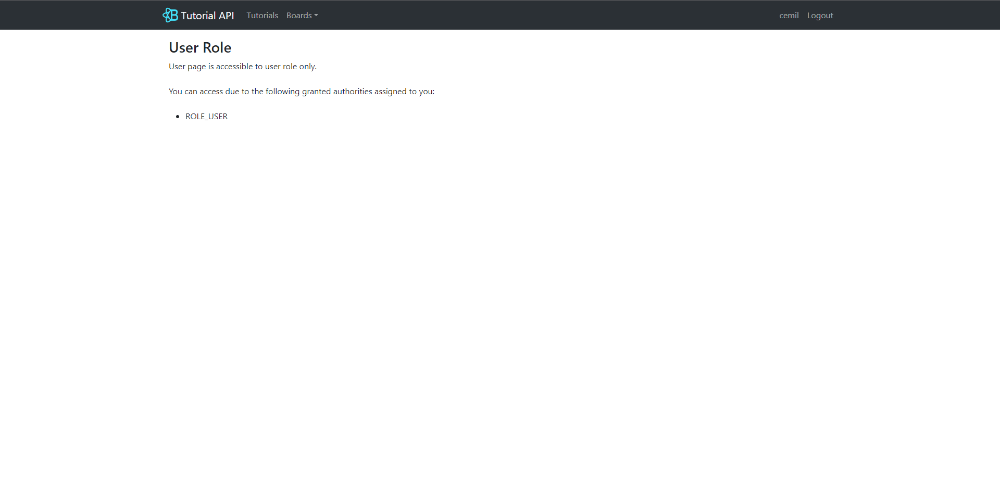

> * ROLE_MOD can see the content on this page.
>
>   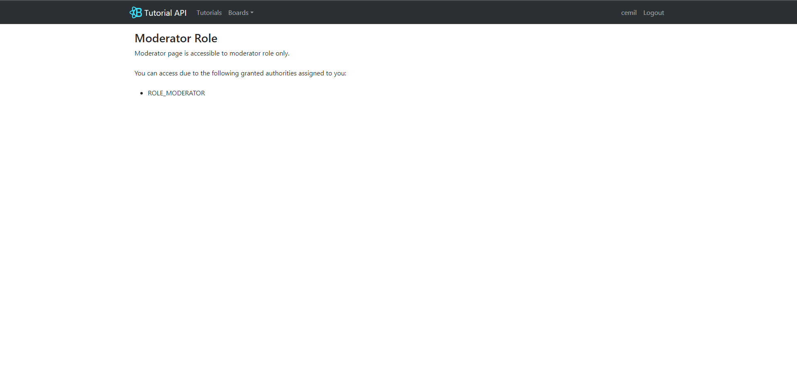

> * ROLE_ADMIN can see the content on this page.
>
>   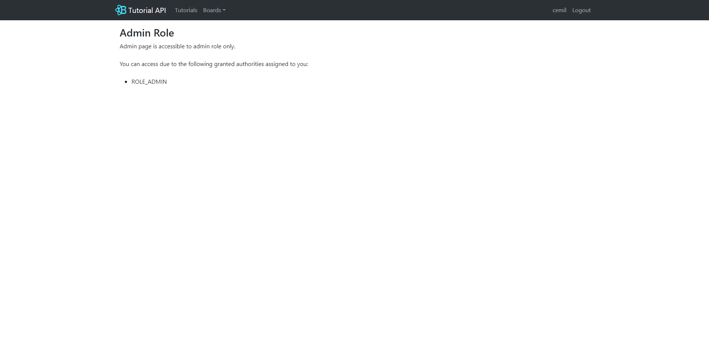

### **Navbar**
> * Navbar changes according to the user's role. 
> * Below is an example of the navbar for ROLE_ADMIN, ROLE_MOD and ROLE_USER.
>
>   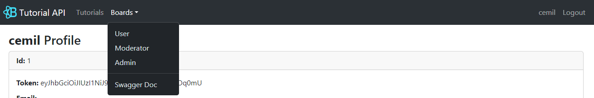


## ©License


## 📌Contributors

<a href="https://github.com/Ctere1/">
  
</a>

